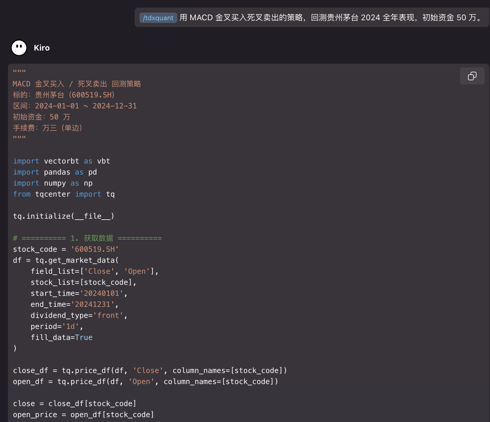
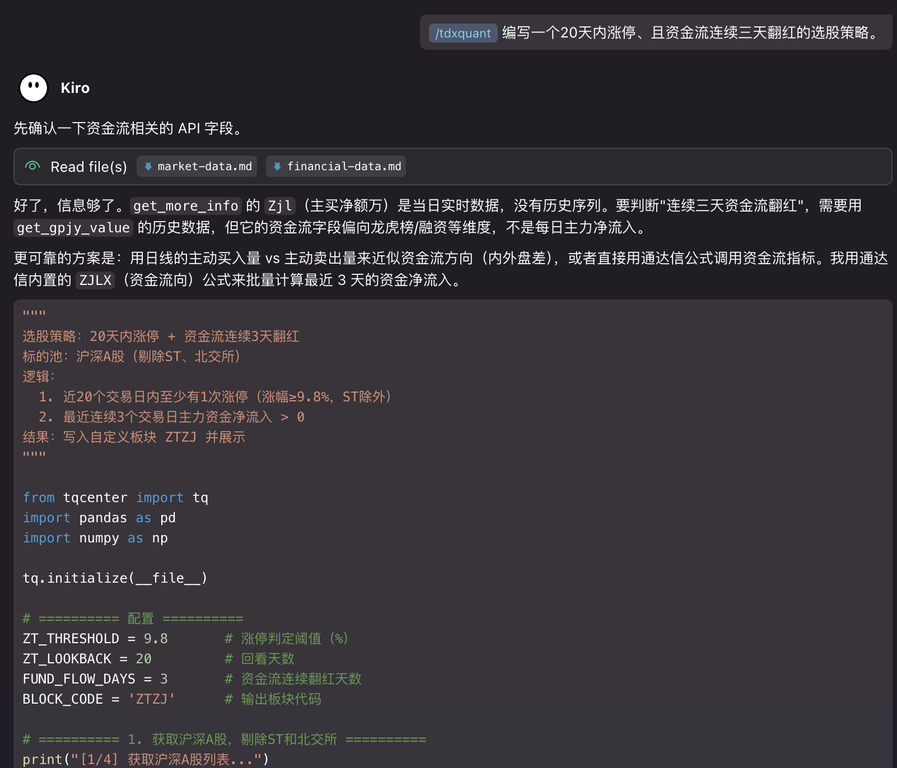

# TdxQuant Claude Code Skill

TdxQuant（通达信量化）全能开发助手。基于 tqcenter Python API 帮助用户完成量化策略开发全流程。

## 功能特性

- 📊 **数据获取** - K线、快照、财务、板块成份股
- 🎯 **选股策略** - 技术指标、基本面筛选、公式调用
- 📈 **回测验证** - 配合 vectorbt 进行策略回测
- 🔔 **实时监控** - 行情订阅、条件预警
- 📦 **板块管理** - 自定义板块、批量操作
- 🧮 **公式调用** - 调用通达信内置公式

## 环境要求

- Python 3.11+（建议 3.13）
- 通达信金融终端（支持 TQ 策略功能）
- 依赖包:
pip install numpy -i https://pypi.tuna.tsinghua.edu.cn/simple
pip install pandas -i https://pypi.tuna.tsinghua.edu.cn/simple
pip install backtrader -i https://pypi.tuna.tsinghua.edu.cn/simple
pip install vectorbt -i https://pypi.tuna.tsinghua.edu.cn/simple

## 快速开始

### 1. 初始化连接

```python
from tqcenter import tq
tq.initialize(__file__)
```

### 2. 编写策略




## API 参考文档

详细 API 文档请查看 `references/` 目录：

- [market-data.md](references/market-data.md) - 行情与基础数据
- [financial-data.md](references/financial-data.md) - 财务与交易数据
- [sector-formula.md](references/sector-formula.md) - 板块管理与公式调用
- [subscribe-notify.md](references/subscribe-notify.md) - 订阅与通知
- [constants.md](references/constants.md) - 常量枚举

## 关键约束

- `get_market_data` 单次最多 24000 条
- `subscribe_hq` 最多订阅 100 只股票
- `send_warn` 的 reason_list 每个元素最多 25 汉字
- 复权类型：行情 API 用 `'none'`/`'front'`/`'back'`，公式 API 用 `0`/`1`/`2`
- 周期：`1m` `5m` `15m` `30m` `60m` `1d` `1w` `1mon` `1q` `1hy` `tick`

## 许可证

MIT License
